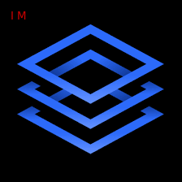

<a name="readme-top"></a>
<!-- TABLE OF CONTENTS -->
<div align="center">
  
</div>


# 📗 Table of Contents

- [📖 About the Project](#about-project)
  - [🛠 Built With](#built-with)
    - [Tech Stack](#tech-stack)
    - [Key Features](#key-features)
- [💻 Getting Started](#getting-started)
  - [Setup](#setup)
  - [Prerequisites](#prerequisites)
  - [Usage](#usage)
- [👥 Author](#author)
- [🔭 Future Features](#future-features)
- [🤝 Contributing](#contributing)
- [⭐️ Show your support](#support)
- [🙏 Acknowledgements](#acknowledgements)

- [📝 License](#license)


# 📖 Budget App <a name="about-project"></a>

**Budget App** is a Ruby on Rails capstone project which you can create new categories, you can write new transactions and deploy it the categories and finally you can control how much money you spend each category.

## Video Link 🚀
[Video here](https://www.loom.com/share/eac07ab097524a31b3d1831607bcb5b9)

## Render Deploy 🚀

[Live demo here](https://mitra-6mqk.onrender.com)

## 🛠 Built With <a name="built-with"></a>
HTML
CSS
JavaScript
Ruby
PostgreSQL
Ruby on Rails
### Tech Stack <a name="tech-stack"></a>

- <a href="https://www.ruby-lang.org/">Ruby</a>
- <a href="https://rubyonrails.org/">Rails</a>
- <a href="https://www.postgresql.org/">PostgreSQL</a>

### Key Features <a name="key-features"></a>

- **CRUD Operations**
- **Authentication**
- **Authorization**


<p align="right">(<a href="#readme-top">back to top</a>)</p>

## 💻 Getting Started <a name="getting-started"></a>

### Prerequisites

To run this project you need the following dependencies:

 - Ruby: `3.2.2`
 - Rails: `7.0.4.3+`
 - PostgreSQL: `15.2+`

### Setup

- Clone this repository to your local machine:
```sh
  git clone https://github.com/djo1975/Budget-app.git
  cd Budget-app
```
- Install dependencies:
```sh
  bundle install
```

- Recreate Data Base:
```sh
  rake db:schema:load
```

### Usage

To run the project, execute the following command in the terminal:

```  sh
  cd Blog_app
  rails s  
```

## 👥 Author <a name="author"></a>

👤 **Mladan Ilic**

- GitHub: [@Ilic](https://github.com/djo1975)
- Twitter: [@Ilic](https://twitter.com/MladanIlic)
- LinkedIn: [@Ilic] (https://www.linkedin.com/in/mladanilic/)

<p align="right">(<a href="#readme-top">back to top</a>)</p>


## 🔭 Future Features <a name="future-features"></a>

- **Add Authentication page**
- **Add authorization rules.**
- **Add API endpoints.**

<p align="right">(<a href="#readme-top">back to top</a>)</p>


## 🤝 Contributing <a name="contributing"></a>

Contributions, issues, and feature requests are welcome!

Feel free to check the [issues page](https://github.com/djo1975/Budget-app/issues).

<p align="right">(<a href="#readme-top">back to top</a>)</p>


## ⭐️ Show your support <a name="support"></a>

Give a ⭐️ if you like this project!

<p align="right">(<a href="#readme-top">back to top</a>)</p>


## 🙏 Acknowledgments <a name="acknowledgements"></a>

I would like to thank Microverse for giving me the opportunity to work on this project. Special thanks Gregoire Vella on Behance who shared his desing.

<p align="right">(<a href="#readme-top">back to top</a>)</p>


## 📝 License <a name="license"></a>

This project is [MIT](./LICENSE) licensed.

<p align="right">(<a href="#readme-top">back to top</a>)</p>
